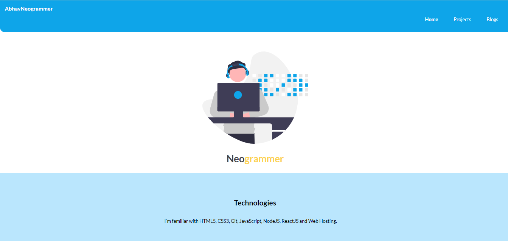
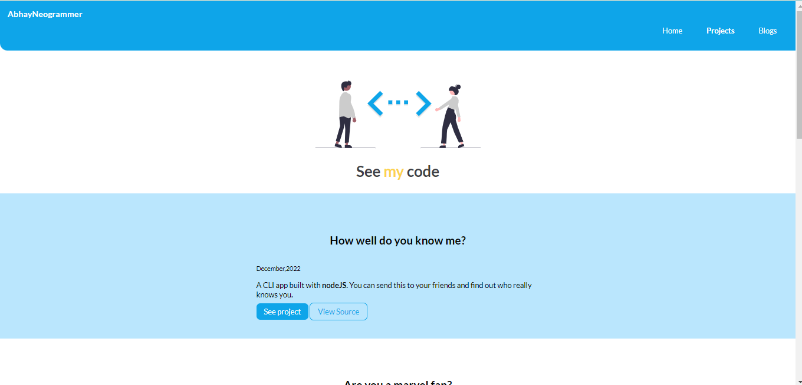
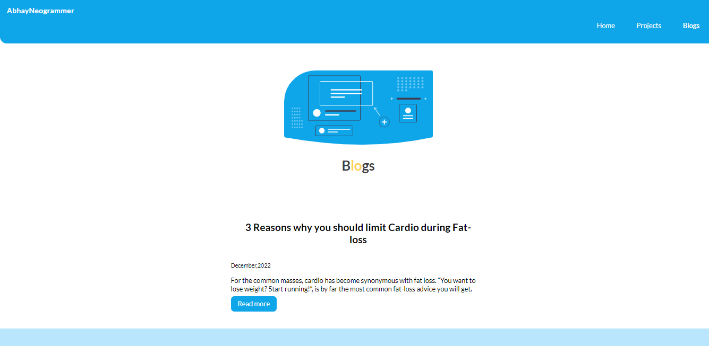

# "Portfolio Website"

<h2>Tech stack:</h2>
HTML and CSS

<h2>About project:</h2>
This project was made as part of level zero of neogcamp.

"Portfolio Website" contains projects,blogs,portfolio.

Project page includes all the projects made during the level zero of neogcamp.

Each project can be viewed live and also user can see its source code.

Blog page includes blogs on different topics.

Social media links are also shared in the end.

<h2>Web app look:</h2>

